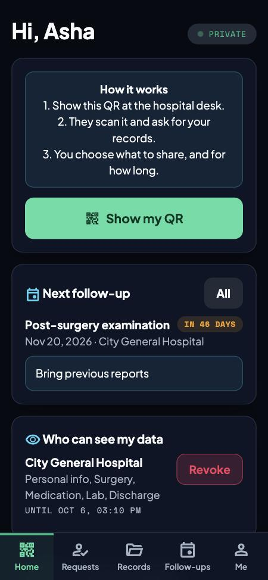
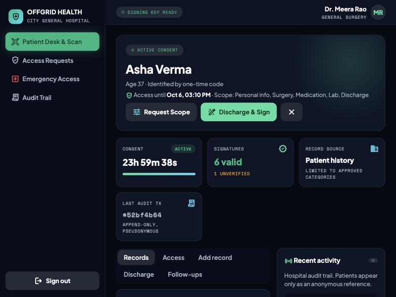
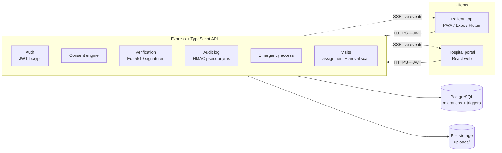
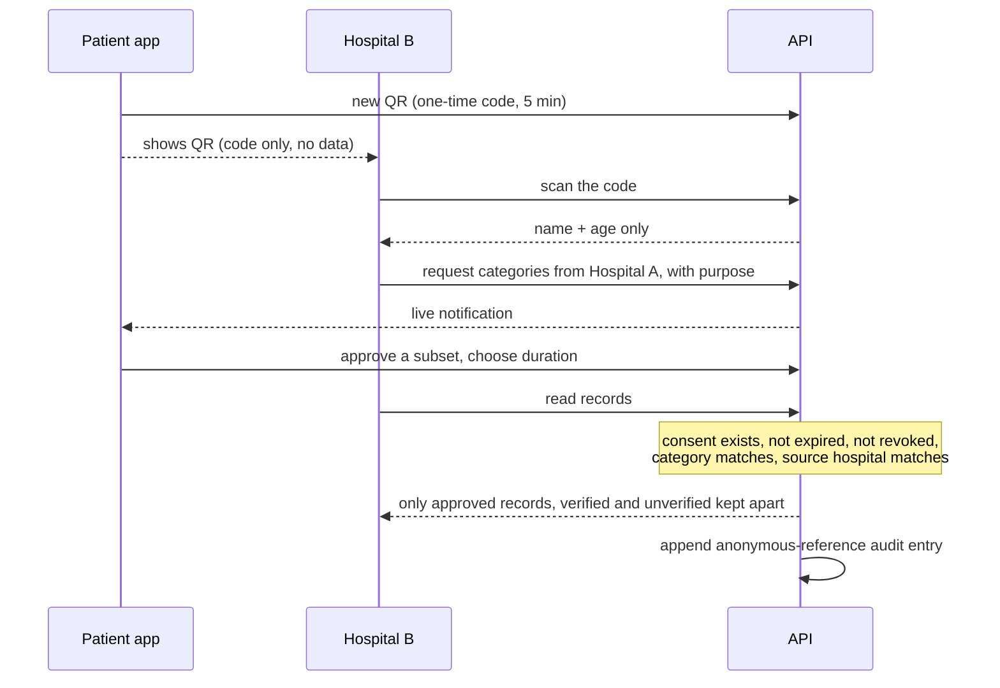

# Offgrid

**Your medical history lives on your phone. Hospitals see only what you approve.**

## What it does in 30 seconds

When you visit a hospital, you show a QR code from the Offgrid app. The hospital scans it, but can see nothing except your name and age until you tap **Approve**. You choose exactly what to share (for example, only surgery records), from which hospital, and for how long. You can take access back at any time.

Doctors **sign** the records they create, so everyone can tell a real clinical record from a photo you uploaded yourself. Every look at your data is written to a log you can read. If you cannot use your phone (an accident, for instance), an emergency card gives a hospital only the critical facts, and you are told about it.

| Patient app (phone) | Hospital portal (desktop) |
|---|---|
|  |  |

| | |
|---|---|
| **Project name** | Offgrid |
| **Team name** | Offgrid |
| **Event** | ASTRA 2026, Cyber in Healthcare |
| **Selected track** | Cyber in Healthcare |
| **Challenge** | Challenge 4: `TODO: challenge title` |
| **License** | [MIT](LICENSE) |
| **Final version for judging** | Git tag [`v1.0-submission`](https://github.com/Anshib-m/Offgrid-/tree/v1.0-submission) |

## Contents

1. [Problem statement](#problem-statement)
2. [Proposed solution](#proposed-solution)
3. [Key features](#key-features)
4. [Words used in this README](#words-used-in-this-readme)
5. [Technology stack](#technology-stack)
6. [System architecture](#system-architecture)
7. [Setup and installation](#setup-and-installation)
8. [Usage instructions](#usage-instructions)
9. [Demo instructions](#demo-instructions-about-5-minutes)
10. [Testing and evaluation results](#testing-and-evaluation-results)
11. [Security and privacy](#security-and-privacy)
12. [Safety, assumptions and human oversight](#safety-assumptions-and-human-oversight)
13. [Limitations](#limitations)
14. [Repository layout](#repository-layout)
15. [Team members and contributions](#team-members-and-contributions)
16. [Third-party components](#third-party-components)
17. [License](#license)

## Problem statement

- Patients repeat the same details at every hospital, and their history is scattered across hospitals.
- Patients cannot see or control who accessed their records.
- A photo of a test report looks the same as a doctor-verified record, so unverified data can pass as clinical history.
- Hospitals that share records today tend to share everything, to whoever asks.
- An unconscious patient cannot approve anything, yet emergency staff need critical facts.
- Patients lose discharge papers and forget follow-ups.

## Proposed solution

A consent-first data exchange between patients and hospitals:

1. The patient shows a one-time QR code. It carries **no medical data**.
2. The hospital scans it and sees **name and age only**.
3. The hospital requests specific categories (optionally from one named hospital only). The patient approves, narrows or denies, with a time limit.
4. The backend returns only what the consent allows. New records start **UNVERIFIED** and become part of verified history only when a doctor signs them.
5. Every access is written to a tamper-resistant log that stores an anonymous reference to the patient, not their name.
6. Emergency access shows critical fields only, for one hour, and always notifies the patient.

## Key features

**Patient app** (works in a phone browser; installable)
- One-time QR identity. Approve, narrow or deny each request, with a duration. Revoke any time.
- History split into **Verified** (doctor-signed) and **Unverified** (self-uploaded), with photos shown inline.
- Home dashboard: your visit and doctor, next follow-up, who can see my data now, profile completeness, emergency card, recent activity. Full access-history page.
- **My doctors**: revoke a single doctor without cutting off the rest of the hospital, and allow them again later. Revoking also cancels any current visit with that doctor.
- Profile photo, name and date-of-birth editing, forgot-password reset, delete your own unverified uploads.
- Emergency card and family codes.

**Hospital portal**
- Scan or paste the QR. Request exactly the categories needed ("Select all" is available).
- Active Patients page, several patients open as tabs, and the hospital can end its own access.
- Add records, upload reports, doctor verify-and-sign, discharge with prescription and follow-up reminder.
- **Doctors & Assignments** (reception and doctors): see which doctors are available and send a patient to one, with a reason.
- **My Patients** (doctors): availability switch (Available / Busy / Off duty), the queue reception built, and the arrival scan.
- **Arrival QR:** when the patient reaches the doctor, the doctor scans the patient's QR again. That starts the consultation and opens the patient's file with the reason for the visit. The patient app tells the patient which doctor to go to.
- Emergency access and a hospital audit trail.

**Security**: consent checks on every read, doctor signatures, records that cannot be edited once signed, tamper-resistant audit log, encrypted clinical notes, hashed passwords, input validation, rate-limited password reset. Details in [docs/THREAT_MODEL.md](docs/THREAT_MODEL.md).

## Words used in this README

| Term | Plain meaning |
|---|---|
| **Consent** | The patient's recorded approval for one hospital to see certain categories, until a set time. It can be revoked. |
| **Verified / Unverified** | Verified = a doctor reviewed and signed the record. Unverified = added but not yet signed (for example, a photo the patient uploaded). |
| **QR code / nonce** | The QR holds a random one-time code. It is not linked to any medical data, works once, and expires in 5 minutes. |
| **Digital signature (Ed25519)** | A doctor's tamper-evident signature. If anyone changes a signed record, the signature check fails and the app warns. |
| **Audit log** | A permanent list of who did what to whose data, and when. |
| **Pseudonymous reference** | A scrambled ID used in the audit log instead of the patient's name. Someone who holds the secret key could link it back, so it is **not** anonymous. |
| **Emergency access ("break glass")** | For an unconscious patient: a card gives critical facts only (blood group, allergies, conditions, emergency contact) for one hour, and is always logged. |
| **Database trigger** | A rule inside the database that blocks changes, for example editing a signed record or the audit log. |
| **JWT** | The login token the app keeps after you sign in. |
| **SSE** | Live updates pushed from the server, so screens refresh without reloading. |
| **PWA** | A web app you can add to a phone's home screen. |

## Technology stack

| Layer | Tech |
|---|---|
| Patient app and hospital portal | React, TypeScript, Vite (one project, two entry points) |
| API | Node.js, Express, TypeScript, zod, JWT, bcryptjs, helmet, multer |
| Database | PostgreSQL, Prisma ORM and migrations, database triggers |
| Crypto | Node `crypto`: Ed25519 signatures, AES-256-GCM, HMAC-SHA256, SHA-256 |
| Live updates | Server-sent events plus polling |
| Optional native apps | Expo / React Native (`mobile/`), Flutter (`patient_flutter/`) |
| Tests | Node test runner, one end-to-end scenario against the real API and database |

## System architecture



Data flow when Hospital B reads Hospital A's records:



PostgreSQL keeps patients, hospitals, staff, medical records, documents, verifications, access requests, consents, visits, discharge records, follow-ups and audit logs in separate related tables. Consent is its own table, never a flag on a record. Migrations are in `server/prisma/migrations`.

## Setup and installation

Needs **Node.js 20 or newer**. No Docker needed. You will use **four terminal windows**, all in the project folder.

**1. Install and configure (once, any terminal)**

```bash
cp .env.example server/.env     # placeholders only. Replace every value outside local testing.
npm install
```

**2. Terminal 1: start the database. Leave it running.**

```bash
npm run db      # wait for the line: postgres ready on :5433
```

(Any PostgreSQL works if you set `DATABASE_URL` in `server/.env`.)

**3. Terminal 2: create the tables and demo data (once)**

```bash
npm run migrate
npm run seed
```

**4. Terminal 3: start the API. Leave it running.**

```bash
npm run server  # wait for: api on :4000
```

**5. Terminal 4: start the web apps. Leave it running.**

```bash
npm run web
```

Open the patient app at **http://localhost:5173/** and the hospital portal at **http://localhost:5173/hospital/**.

**Open it on another device (optional).** On the same Wi-Fi, a phone can open `http://<your computer's IP>:5173`. To share a link over the internet from VS Code, open the **Ports** tab (next to Terminal), choose **Forward a Port**, enter **5173**, and set its visibility to Public. Port 5173 also serves the API at `/api`, so it is the only port to forward. Anyone with the link can open the demo, so stop forwarding afterwards. The camera needs the `https` link, otherwise paste the QR code. The settings in `.vscode/settings.json` label the ports.

**Start over with fresh demo data:** stop the database (Ctrl+C in terminal 1), delete the `.pgdata` folder, then repeat steps 2 and 3.

Optional native apps: see [Native patient apps](#native-patient-apps-optional).

## Usage instructions

**Patient**
1. Sign in to the patient app.
2. At a hospital, tap **Show my QR** on Home and let the desk scan it.
3. When a hospital asks for data, open **Requests**. Untick anything you don't want to share, pick how long, and tap **Approve** (or **Deny**).
4. Check **Home** for your visit, follow-ups and who can see your data. Tap **Revoke** to cut a hospital off, or **Revoke doctor** under "My doctors" to cut off just one doctor. Tap **Recent activity** for the full access history.

**Reception**
1. Sign in to the hospital portal. On **Patient Desk**, paste the patient's QR code and request the categories you need.
2. On **Doctors & Assignments**, choose the patient, type the reason, and assign an available doctor.

**Doctor**
1. You land on **My Patients**. Set yourself Available, Busy or Off duty.
2. When your patient arrives, ask them to show their QR, scan or paste it, and the consultation starts.
3. In the patient's file: add records, **Verify & Sign** unverified ones, **Discharge** with a prescription and follow-up, then **Complete visit**.

### Demo accounts

These are **synthetic** accounts created by the seed script for local use only. They are not real credentials.

| Role | Hospital | Login | Password |
|---|---|---|---|
| Patient (Asha) | n/a (patient app) | `asha@example.test` | `demo1234` |
| Reception | City General | `desk@citygeneral.test` | `demo1234` |
| Doctor | City General | `dr.rao@citygeneral.test` | `demo1234` |
| Reception | Riverside Medical Centre | `desk@riverside.test` | `demo1234` |
| Doctor | Riverside Medical Centre | `dr.mehta@riverside.test` | `demo1234` |
| Reception | Lakeside Community Hospital | `desk@lakeside.test` | `demo1234` |
| Doctor | Lakeside Community Hospital | `dr.nair@lakeside.test` | `demo1234` |

Emergency card code: `DEMO-EMERGENCY-CARD-ASHA` (used on the hospital portal's Emergency page).

## Demo instructions (about 5 minutes)

**Setup for the demo:** open the patient app in one browser tab and the hospital portal in other tabs. **Each browser tab keeps its own sign-in**, so use one tab per person and don't sign out. A phone-sized window works best for the patient. Each QR works **once** and expires after 5 minutes, so tap **Show my QR** again before every scan.

Asha already has history at City General (a surgery, lab, medication and discharge records, a dermatology consult, an unverified blood test, and a follow-up).

**Pitch deck and talk script:** [docs/pitch/Offgrid-pitch.pdf](docs/pitch/Offgrid-pitch.pdf) (editable: [`.pptx`](docs/pitch/Offgrid-pitch.pptx)) and the timed 5-minute [script](docs/pitch/SCRIPT.md).

**Part 1: Share records between hospitals**
1. **Patient app**, signed in as `asha@example.test`. Home, tap **Show my QR**. Copy the code shown under the QR.
2. **Hospital tab, `desk@riverside.test`** (Riverside reception). Patient Desk, paste the code, **Identify patient**. Only name and age appear.
3. Same tab, **Access** tab: tick Surgery, Lab and Medication. Under "Records from another hospital" pick **City General Hospital only**. Purpose: "Pre-operative review". **Send request**.
4. **Patient app**: a notification appears. Open Requests, untick **Lab**, set 1 hour, **Approve selected**.
5. **Riverside tab**, **Records**: only Surgery and Medication from City General appear. The dermatology consult and the lab results are not shown.

**Part 2: Verified and unverified records**
6. **Riverside tab** (reception), **Add record**: add a Lab record. It shows as **UNVERIFIED**.
7. New tab, sign in as **`dr.mehta@riverside.test`**. Active Patients, **Open profile** for Asha, Records. On the unverified record tap **Verify & Sign Record**. It becomes **ED25519 SIGNED** with Dr. Mehta's name.

**Part 3: A visit with a doctor**
8. **Patient app**: Show my QR (a new one). New tab, sign in as **`desk@citygeneral.test`**. Patient Desk, paste, identify. Access tab, **Select all**, purpose "Check-in". **Send request**. In the patient app, **Approve**.
9. City General tab, **Doctors & Assignments**: patient Asha, reason "Post-surgery review", **Assign patient** on Dr. Meera Rao. The patient app Home now shows **Your visit**.
10. New tab, sign in as **`dr.rao@citygeneral.test`**. **My Patients** lists Asha under Waiting. In the patient app tap **Show my QR** again. In Dr. Rao's tab paste the code and **Start consultation**. Asha's file opens with the visit reason on top.
11. In that file, **Discharge** tab: write a summary, add a prescription and a follow-up date, **Discharge & Sign**. Back in the patient app, Records show the signed discharge, and Follow-ups shows the reminder. Dr. Rao taps **Complete visit**.

**Part 4: The patient stays in control, and emergencies**
12. **Patient app**, Home, "Who can see my data": tap **Revoke** on Riverside. In the Riverside tab, Records now shows a locked message.
13. Any hospital tab, **Emergency Access**: paste `DEMO-EMERGENCY-CARD-ASHA`, give a reason, **Execute emergency override**. Only blood group, allergies, conditions and the emergency contact appear. In the patient app, Recent activity shows the access.

## Testing and evaluation results

`npm test` runs an end-to-end scenario with **90 assertions** against the real API and PostgreSQL. **Latest result: 1 test, 1 pass, 0 fail.** Type checks (`tsc`) pass for the API and the web apps.

It covers sign-in and permissions, one-time QR use, consent checks (including narrowing, revoking and hospital-ended access), record verification and signatures, deletion rules, profile photo rules, date-of-birth changes, password reset with lockout, doctor assignment and the arrival scan, emergency access and audit visibility.

Full case table, how to reproduce, screenshots and the limits of this testing: [docs/TESTING.md](docs/TESTING.md).

## Security and privacy

- **No real data.** Everything is synthetic (see Safety). No secrets are committed: `.env` is git-ignored and only placeholder `.env.example` files are tracked.
- The QR holds a one-time code valid for 5 minutes. A scan, or existing active consent, is required before a hospital can send a request.
- Every read needs a valid, unexpired, unrevoked consent **and** a matching category **and** a matching source hospital.
- A patient can revoke a single doctor. That doctor is refused everywhere (records, documents, signing, requests, arrival scan) while the hospital's other staff keep their access.
- Only the assigned doctor's scan can start a consultation. A QR for a patient who is not assigned to that doctor is refused and is not used up.
- Signed records cannot be edited or deleted (database rule). The audit log cannot be edited or deleted (database rule).
- Audit entries use a scrambled patient reference (`HMAC-SHA256(patientId, secret)`). This is **pseudonymization**, not anonymization. Hashing alone is not treated as anonymous.
- Threats, mitigations and what is left over: [docs/THREAT_MODEL.md](docs/THREAT_MODEL.md).

## Safety, assumptions and human oversight

- **Data:** all names, emails (`*.test`, `example.test`), phone numbers, hospitals and records are invented by `server/src/seed.ts`. No real patient or hospital data is used.
- **Environment:** everything runs locally. No real hospital system, medical device or third-party infrastructure is scanned, attacked or contacted.
- **Human oversight:** every share needs patient approval. A record joins verified history only when a doctor signs it. A consultation starts only when the assigned doctor scans the patient's QR. Emergency access notifies the patient and is always logged.
- **AI/ML:** the product contains no AI or ML model, so there are no predictions, false positives or false negatives to report. AI-assisted coding is disclosed under Third-party components.
- **Medical devices:** none are involved.

## Limitations

| In this prototype | In production |
|---|---|
| Doctor signing keys in the database (encrypted) | HSM/KMS, doctor identity proofing, medical council registry lookup |
| Hospital onboarding via the seed script | Verified hospital registration and licensing |
| QR via browser camera or pasted text, NFC not wired | NFC tag and card issuance |
| Files on local disk, not encrypted, no virus scan | Encrypted object storage with scanning |
| Live updates in memory plus polling, one API instance | Message broker, native push (FCM/APNs) |
| Desk registration records a 24-hour consent as "patient present" | Identity verification at the desk |
| Family member = a second emergency code | Verified delegate accounts with their own approval |
| Password reset by date of birth (a weak factor), in-memory lockout | Emailed link or OTP, MFA, shared rate limiting |
| TLS not set up locally, login token kept in `sessionStorage` | TLS everywhere, HttpOnly cookies, refresh rotation |
| Not covered by any regulatory review | HIPAA, GDPR, DPDP Act, ABDM review and a DPIA |

Also: one end-to-end test and manual checks, no independent penetration test. The native apps lack some web features (profile photo, access-history page, date-of-birth edit, forgot password, visit card).

## Repository layout

```
.
├── README.md  LICENSE  .gitignore  .env.example
├── docs/                 threat model, testing evidence, screenshots, pitch deck
├── server/
│   ├── src/              API (routes, consent engine, crypto, audit)
│   ├── prisma/           database schema and migrations
│   └── test/             end-to-end test
├── web/
│   ├── src/              patient app, hospital portal, shared UI
│   └── public/
├── mobile/               Expo / React Native patient app (optional)
└── patient_flutter/      Flutter patient app (optional)
```

## Native patient apps (optional)

<details>
<summary>Expo / React Native and Flutter versions of the patient app</summary>

**Expo / React Native** (`mobile/`):

```bash
cd mobile
cp .env.example .env   # set EXPO_PUBLIC_API_URL=http://<your computer's LAN IP>:4000 for a real phone
npm start              # scan the QR with Expo Go; phone and computer on the same Wi-Fi
```

**Flutter** (`patient_flutter/`), Android and iOS:

```bash
cd patient_flutter
flutter pub get
flutter run                                              # Android emulator reaches the API at 10.0.2.2:4000
flutter run --dart-define=API_URL=http://<LAN IP>:4000   # real phone, same Wi-Fi
flutter build apk                                        # installable Android APK
flutter run -d "iPhone 18 Pro"                           # iOS simulator (reaches localhost:4000)
```

Android needs the Android SDK. iOS needs Xcode, an iOS Simulator runtime and CocoaPods. Both native apps poll every 5 seconds, and the Flutter app allows cleartext HTTP for local development only.

</details>

## Team members and contributions

Team **Offgrid**.

| Member | Contribution | GitHub |
|---|---|---|
| Anshib M | Contributor | [@Anshib-m](https://github.com/Anshib-m) |
| Ahmed Safwan | Contributor | n/a |
| Joffin Jaison | Contributor | n/a |
| Alan KP | Contributor | n/a |

## Third-party components

Standard open-source libraries, used as published. **No external datasets, models or third-party APIs** are used. Each library keeps its own license.

| Area | Components |
|---|---|
| API | Express, cors, helmet, zod, jsonwebtoken, bcryptjs, multer, Prisma (`@prisma/client`, `prisma`), TypeScript, tsx |
| Dev database | `embedded-postgres` (runs real PostgreSQL without Docker) |
| Web apps | React, React DOM, Vite, `@vitejs/plugin-react`, `qrcode`, `html5-qrcode` |
| Fonts and icons (bundled via `@fontsource`) | Plus Jakarta Sans and Space Mono (SIL OFL 1.1), Material Symbols (Apache 2.0) |
| Expo app | Expo, React Native, `react-native-qrcode-svg`, `react-native-svg`, `expo-document-picker`, `expo-secure-store` |
| Flutter app | Flutter, `http`, `http_parser`, `flutter_secure_storage`, `qr_flutter`, `file_picker` |

Tools used while building: the hospital dashboard look was prototyped with Google Stitch (AI design tool) and then implemented by hand in `web/src/shared/style.css`. Code was written with AI assistance (Claude Code). Commits carry a `Co-Authored-By` trailer.

## License

[MIT](LICENSE). Copyright (c) 2026 Offgrid team (Anshib M, Ahmed Safwan, Joffin Jaison, Alan KP). All code, documentation, scripts and design artifacts in this repository are released under this license.
