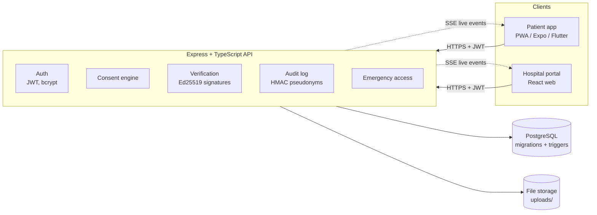
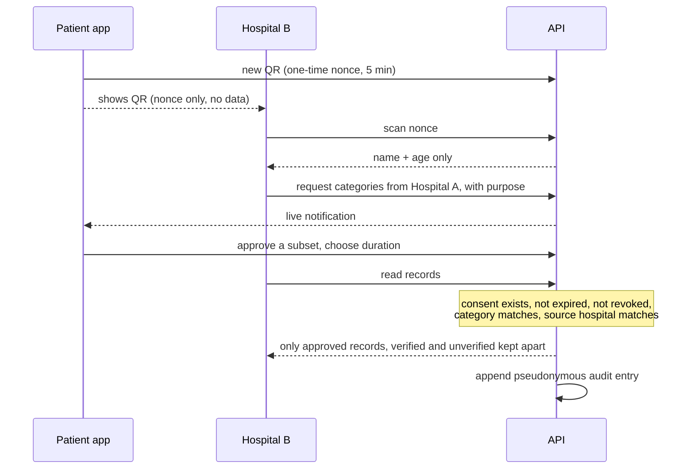

# Offgrid

**A patient-controlled medical record ecosystem.** The patient owns their records and decides, request by request, which hospital sees what and for how long. Hospitals create records, doctors verify and sign them, and every access is audited.

| | |
|---|---|
| **Project name** | Offgrid |
| **Team name** | `TODO: team name` |
| **Event** | ASTRA 2026, Cyber in Healthcare |
| **Selected track** | `TODO: selected track` |
| **Challenge** | `TODO: challenge number and title` |
| **License** | [MIT](LICENSE) |
| **Final version for judging** | `TODO: tag / release / commit, set before the deadline` |

## Problem statement

- Patients repeat the same details at every hospital, and their history is scattered across hospitals.
- Patients cannot see or control who accessed their records.
- A photo of a test report looks the same as a doctor-verified record, so unverified data can pass as clinical history.
- Hospitals that share records today tend to share everything, to whoever asks.
- An unconscious patient cannot approve anything, yet emergency staff need critical facts.
- Patients lose discharge papers and forget follow-ups.

## Proposed solution

A consent-first data exchange between patients and hospitals:

1. The patient shows a one-time QR code. It carries **no medical data**.
2. The hospital scans it and sees **name and age only**.
3. The hospital requests specific categories (optionally from one named hospital only). The patient approves, narrows or denies, with a time limit.
4. The backend returns only what the consent allows. New records start **UNVERIFIED** and become part of verified history only when a doctor signs them with Ed25519.
5. Every access is written to an append-only audit log that stores a pseudonymous patient reference, not names.
6. Emergency "break glass" access shows critical fields only, for one hour, and always notifies the patient.

## Key features

**Patient app (PWA, mobile-first)**
- One-time QR identity. Approve, narrow or deny each request, with a duration. Revoke any time.
- History split into **Verified** (doctor-signed) and **Unverified** (self-uploaded), with photos shown inline.
- Home dashboard: next follow-up, who can see my data now, profile completeness, emergency card, recent activity. Full access-history page.
- Profile photo, name and date-of-birth editing, forgot-password reset, delete own unverified uploads.
- Emergency card and family codes.

**Hospital portal**
- Scan or paste the QR. Request exactly the categories needed ("Select all" available).
- Active Patients page, several patients open as tabs, the hospital can end its own access.
- Add records, upload reports, doctor verify-and-sign, discharge with prescription and follow-up reminder.
- Emergency break-glass access and a hospital audit trail.

**Security**: consent engine, Ed25519 record signatures, immutable verified records, pseudonymous append-only audit log, AES-256-GCM encryption of clinical notes, bcrypt, input validation, rate-limited password reset. Details in [docs/THREAT_MODEL.md](docs/THREAT_MODEL.md).

## Technology stack

| Layer | Tech |
|---|---|
| Patient app and hospital portal | React, TypeScript, Vite (one project, two entry points) |
| API | Node.js, Express, TypeScript, zod, JWT, bcryptjs, helmet, multer |
| Database | PostgreSQL, Prisma ORM and migrations, database triggers |
| Crypto | Node `crypto`: Ed25519 signatures, AES-256-GCM, HMAC-SHA256, SHA-256 |
| Live updates | Server-sent events plus polling |
| Optional native apps | Expo / React Native (`mobile/`), Flutter (`patient_flutter/`) |
| Tests | Node test runner, one end-to-end scenario against the real API and database |

## System architecture



Data flow when Hospital B reads Hospital A's records:



PostgreSQL keeps patients, hospitals, staff, medical records, documents, verifications, access requests, consents, discharge records, follow-ups and audit logs in separate related tables. Consent is its own table, never a flag on a record. Migrations are in `server/prisma/migrations`.

## Setup and installation

Needs Node.js 20 or newer. No Docker needed.

```bash
cp .env.example server/.env          # then replace every value (placeholders only, no real secrets are committed)
npm install
npm run db        # terminal 1: embedded PostgreSQL on :5433. Or point DATABASE_URL at any PostgreSQL.
npm run migrate   # terminal 2: apply migrations
npm run seed      # load synthetic demo data
npm run server    # API on http://localhost:4000
npm run web       # patient app http://localhost:5173/ , hospital portal http://localhost:5173/hospital/
```

Optional native apps: see [Native patient apps](#native-patient-apps-optional).

## Usage instructions

1. Open the patient app, sign in, tap **Show my QR**.
2. Open the hospital portal in another tab, sign in as reception or a doctor, and paste the QR code on the Patient Desk.
3. Request the data you need. The patient approves on their phone.
4. Work on the patient (records, uploads, verify and sign, discharge, follow-ups). Several patients can stay open as tabs.
5. Either side can end access at any time.

### Demo accounts

These are **synthetic** accounts created by the seed script for local use only. They are not real credentials.

| Who | Login | Password |
|---|---|---|
| Patient (Asha) | `asha@example.test` (patient app) | `demo1234` |
| Hospital A doctor / reception | `dr.rao@citygeneral.test` / `desk@citygeneral.test` | `demo1234` |
| Hospital B doctor / reception | `dr.mehta@riverside.test` / `desk@riverside.test` | `demo1234` |
| Emergency card code | `DEMO-EMERGENCY-CARD-ASHA` (Emergency page) | n/a |

## Demo instructions (about 5 minutes)

Use two browser tabs: the patient app in a phone-sized window, the hospital portal on desktop.

1. Patient, Home: **Show my QR**.
2. Hospital B desk, Patient Desk: paste the code. It shows **name and age only**.
3. Access tab: request Surgery, Lab, Medication from "City General only", purpose "Pre-operative review".
4. The patient app notifies live. Requests: untick Lab, **Approve** for 1 hour.
5. Hospital B, Records: only Surgery and Medication, only from Hospital A. The consult and Lab stay hidden.
6. Hospital B adds a record. It stays UNVERIFIED until Dr. Mehta uses **Verify & Sign**.
7. Dr. Rao (Hospital A), Discharge: signed summary and prescription, and the follow-up reaches the patient.
8. Hospital B, Active Patients: the patient is listed. The patient taps **Revoke** (or the hospital does) and the patient drops off the list. Access history shows every event.
9. Hospital, Emergency: card code plus a reason shows critical fields only. The patient is notified.

Seeded data lives at Hospital A: signed surgery, lab, medication and discharge records, an unrelated dermatology consult, one unverified patient-uploaded blood test and a follow-up on 20 Nov 2026.

## Testing and evaluation results

`npm test` runs an end-to-end scenario with **54 assertions** against the real API and PostgreSQL. **Latest result: 1 test, 1 pass, 0 fail.** Type checks (`tsc`) pass for the API and the web apps.

It covers authentication and authorization, QR single use, consent checks (including narrowing, revoking and hospital-ended access), record verification and signatures, deletion rules, profile photo rules, date-of-birth changes, password reset with lockout, emergency access and audit visibility.

Full case table, reproduction steps, screenshots and the limits of this testing: [docs/TESTING.md](docs/TESTING.md).

## Security and privacy

- **No real data.** Everything is synthetic (see Safety). No secrets are committed: `.env` is git-ignored and only placeholder `.env.example` files are tracked.
- QR holds an opaque one-time nonce (5 minutes). A scan, or existing active consent, is required before a request.
- Read path: valid, unexpired, unrevoked consent **and** category match **and** source-hospital match.
- Verified records are immutable (database trigger) and cannot be deleted. The audit log is append-only (database trigger).
- Audit entries use `HMAC-SHA256(patientId, pepper)`. This is **pseudonymization**, not anonymization. Hashing alone is not treated as anonymous.
- Threats, mitigations and residual risks: [docs/THREAT_MODEL.md](docs/THREAT_MODEL.md).

## Safety, assumptions and human oversight

- **Data:** all names, emails (`*.test`, `example.test`), phone numbers, hospitals and records are invented by `server/src/seed.ts`. No real patient or hospital data is used.
- **Environment:** everything runs locally. No real hospital system, medical device or third-party infrastructure is scanned, attacked or contacted.
- **Human oversight:** every share needs patient approval. A record joins verified history only when a doctor signs it. Emergency access notifies the patient and is always audited.
- **AI/ML:** the product contains no AI or ML model, so there are no predictions, false positives or false negatives to report. AI-assisted coding is disclosed under Third-party components.
- **Medical devices:** none are involved.

## Limitations

| In this prototype | In production |
|---|---|
| Doctor signing keys in the database (encrypted) | HSM/KMS, doctor identity proofing, medical council registry lookup |
| Hospital onboarding via the seed script | Verified hospital registration and licensing |
| QR via browser camera or pasted text, NFC not wired | NFC tag and card issuance |
| Files on local disk, not encrypted, no virus scan | Encrypted object storage with scanning |
| SSE in memory plus polling, one API instance | Message broker, native push (FCM/APNs) |
| Desk registration records a 24-hour consent as "patient present" | Identity verification at the desk |
| Family member = a second emergency code | Verified delegate accounts with their own approval |
| Password reset by date of birth (a weak factor), in-memory lockout | Emailed link or OTP, MFA, shared rate limiting |
| TLS not set up locally, JWT kept in `sessionStorage` | TLS everywhere, HttpOnly cookies, refresh rotation |
| Not covered by any regulatory review | HIPAA, GDPR, DPDP Act, ABDM review and a DPIA |

Also: one end-to-end test and manual checks, no independent penetration test. The native apps lack some web features (profile photo, access-history page, date-of-birth edit, forgot password).

## Repository layout

```
.
├── README.md  LICENSE  .gitignore  .env.example
├── docs/                 threat model, testing evidence, screenshots
├── server/
│   ├── src/              API (routes, consent engine, crypto, audit)
│   ├── prisma/           schema and migrations
│   └── test/             end-to-end test
├── web/
│   ├── src/              patient app, hospital portal, shared UI
│   └── public/
├── mobile/               Expo / React Native patient app (optional)
└── patient_flutter/      Flutter patient app (optional)
```

## Native patient apps (optional)

**Expo / React Native** (`mobile/`):

```bash
cd mobile
cp .env.example .env   # set EXPO_PUBLIC_API_URL=http://<your computer's LAN IP>:4000 for a real phone
npm start              # scan the QR with Expo Go; phone and computer on the same Wi-Fi
```

**Flutter** (`patient_flutter/`), Android and iOS:

```bash
cd patient_flutter
flutter pub get
flutter run                                              # Android emulator reaches the API at 10.0.2.2:4000
flutter run --dart-define=API_URL=http://<LAN IP>:4000   # real phone, same Wi-Fi
flutter build apk                                        # installable Android APK
flutter run -d "iPhone 18 Pro"                           # iOS simulator (reaches localhost:4000)
```

Android needs the Android SDK. iOS needs Xcode, an iOS Simulator runtime and CocoaPods. Both native apps poll every 5 seconds, and the Flutter app allows cleartext HTTP for local development only.

## Team members and contributions

| Member | Contribution | GitHub |
|---|---|---|
| Anshib-m | `TODO: role and contribution` | [@Anshib-m](https://github.com/Anshib-m) |
| `TODO: name` | `TODO: role and contribution` | `TODO` |
| `TODO: name` | `TODO: role and contribution` | `TODO` |

## Third-party components

Standard open-source libraries, used as published. **No external datasets, models or third-party APIs** are used. Each library keeps its own license.

| Area | Components |
|---|---|
| API | Express, cors, helmet, zod, jsonwebtoken, bcryptjs, multer, Prisma (`@prisma/client`, `prisma`), TypeScript, tsx |
| Dev database | `embedded-postgres` (runs real PostgreSQL without Docker) |
| Web apps | React, React DOM, Vite, `@vitejs/plugin-react`, `qrcode`, `html5-qrcode` |
| Fonts and icons (bundled via `@fontsource`) | Plus Jakarta Sans and Space Mono (SIL OFL 1.1), Material Symbols (Apache 2.0) |
| Expo app | Expo, React Native, `react-native-qrcode-svg`, `react-native-svg`, `expo-document-picker`, `expo-secure-store` |
| Flutter app | Flutter, `http`, `http_parser`, `flutter_secure_storage`, `qr_flutter`, `file_picker` |

Tools used while building: the hospital dashboard look was prototyped with Google Stitch (AI design tool) and then implemented by hand in `web/src/shared/style.css`. Code was written with AI assistance (Claude Code). Commits carry a `Co-Authored-By` trailer.

## License

[MIT](LICENSE). Copyright (c) 2026 Offgrid team. All code, documentation, scripts and design artifacts in this repository are released under this license.
