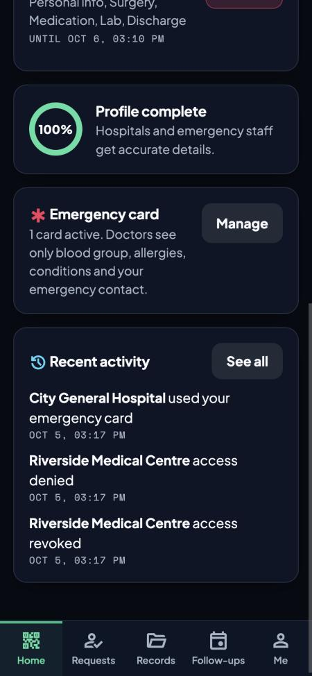
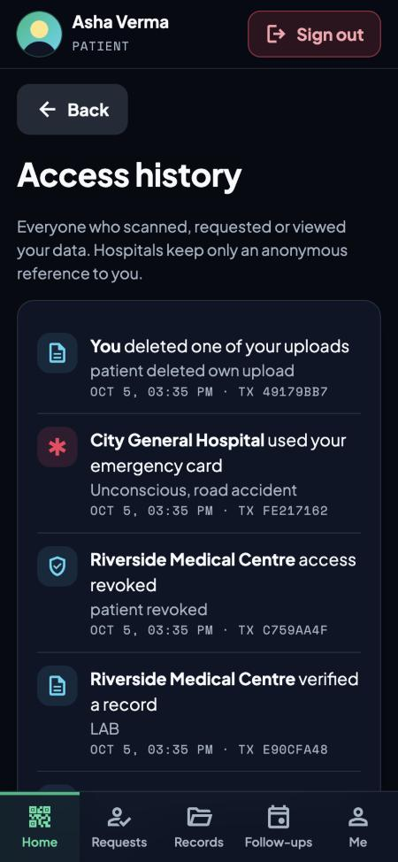
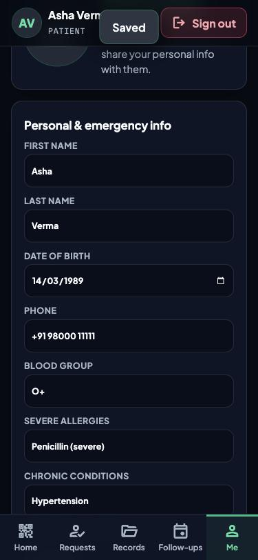
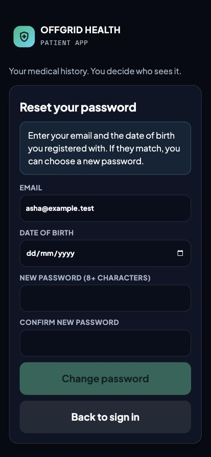
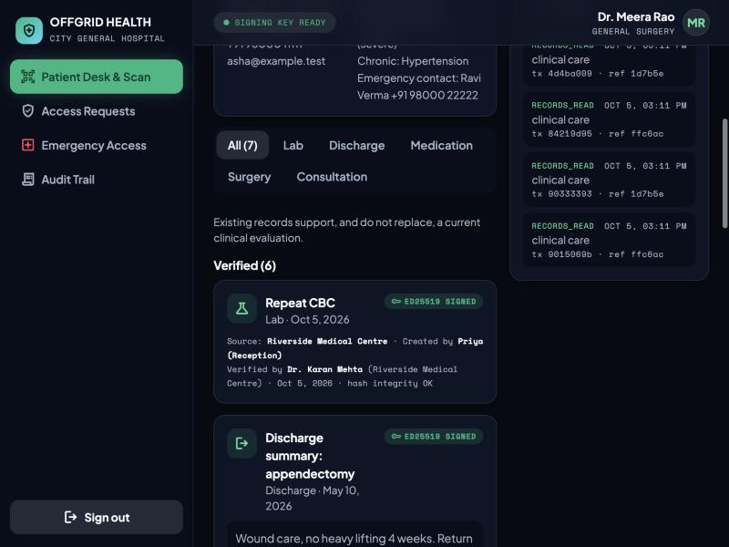

# Testing and evaluation

All testing was done locally, in a controlled environment, against the project's own API and a local PostgreSQL database loaded with synthetic seed data. No real systems or data were involved.

## How to reproduce

```bash
npm install
npm run db        # terminal 1
npm run migrate && npm run seed
npm test          # end-to-end test against the real API and database
```

## Latest result

```
✔ consent, verification, provenance, emergency (1229 ms)
ℹ tests 1   ℹ pass 1   ℹ fail 0
```

`npx tsc` (type check) passes for both `server/` and `web/`.

The single test (`server/test/flow.test.ts`) walks the whole patient journey and contains **54 assertions**. It is intentionally one long scenario because each step depends on the previous one.

## Security and behaviour test cases

| Area | Case | Expected |
|---|---|---|
| Authentication | Wrong staff password | 401 |
| Authorization | No token on a patient endpoint | 401 |
| Authorization | Hospital token on the patient API | 401 |
| QR identity | Scan a patient QR | Name and age only |
| QR identity | Scan the same QR again | 410 (single use) |
| Consent | Hospital reads records before any consent | 403 |
| Consent | Pending request is not consent | 403 |
| Consent | Request without a real scan or consent | 403 |
| Consent | Random patient ID probe | 403 |
| Consent | Patient approves a subset (drops Lab) | Hospital sees only approved categories, only from the source hospital |
| Consent | Personal info not granted | `profile` is null |
| Consent | Active consent allows asking for more, patient denies | 201 then denied |
| Consent | Patient revokes | Hospital gets 403 and disappears from Active Patients |
| Consent | Hospital ends its own access | 200, then 403 on read, 404 on a second revoke |
| Verification | Doctor of another hospital verifies | 403 |
| Verification | Reception verifies | 401 |
| Verification | New hospital record | Starts UNVERIFIED, VERIFIED after a doctor signs it |
| Verification | Signature check | `signatureValid` is true |
| Deletion | Patient deletes own unverified upload | 200, then 404 |
| Deletion | Hospital deletes a patient's upload | 404 |
| Deletion | Patient deletes a hospital record | 404 |
| Deletion | Delete a doctor-signed record | 409 (immutable) |
| Profile photo | Upload a PNG | `hasPhoto` true |
| Profile photo | Upload a PDF as a photo | 400 |
| Profile photo | Hospital without personal-info consent | 403 |
| Date of birth | Change without password | 403 |
| Date of birth | Change with wrong password | 403 |
| Date of birth | Future date | 400 |
| Date of birth | Change with correct password | 200 |
| Password reset | Wrong date of birth | 400 |
| Password reset | Unknown email vs wrong date | Identical error message |
| Password reset | Weak new password | 400 |
| Password reset | Correct date of birth | 200, old password rejected, new one works |
| Password reset | 5 wrong guesses, then the right date | 429 (locked) |
| Emergency | Valid card plus reason | Critical fields only, no records |
| Emergency | Use is audited | Appears in the patient's access history |
| Emergency | Invalid card code | 404 |
| Audit | Revocation and other events | Visible in access history |

## Manual checks done in the browser

- Patient app on a phone-sized window and hospital portal on desktop, full demo walkthrough in the README.
- Live updates: a request appears in the patient app without reloading. A patient upload appears in the hospital view within about 5 seconds. A revoked patient drops off the Active Patients list.
- Photos on records show inline for both sides, only after consent.
- Sign out, forgot password, name and date-of-birth editing, profile photo upload.

## Screenshots (synthetic data only)

| | |
|---|---|
|  Patient home |  Profile, emergency card, activity |
|  Access history |  Profile |
|  Forgot password |  Hospital patient workspace |
|  Signed records with provenance | |

## Limits of this testing

- One scripted end-to-end scenario plus manual checks. No unit-test suite, load test, fuzzing or independent penetration test.
- No performance or accuracy metrics. There is no ML component.
- Rate limiting and lockout are in memory and single-instance.
- The Flutter app was smoke-tested by hand on the iOS simulator (sign in, records). The Expo app was type-checked and bundled but not run on a device. Neither is covered by automated tests.
